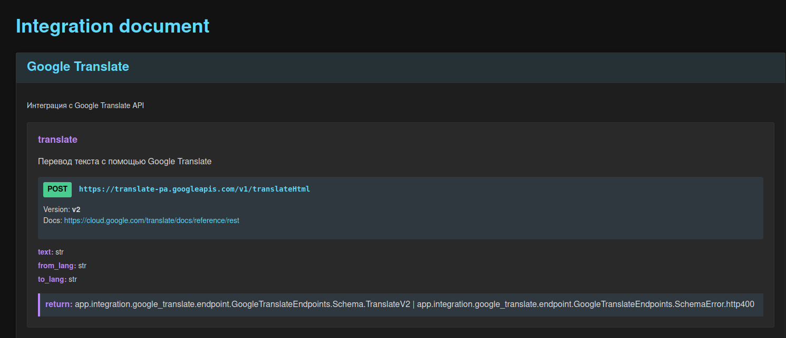

# Fastapi Accelerator бизнес логика

## Зачем нужен, какие проблемы решает ?

Основная цель - ускорить и упростить разработку проектов на FastAPI. Это достигается путем:

1. Предоставления переиспользуемого кода для типовых задач.
2. Внедрения универсального менеджера для работы с РСУБД.
3. Реализации ViewSet для быстрого создания представлений с базовой бизнес-логикой.
4. Интеграции аутентификации по JWT.
5. Добавления удобной админ-панели.
6. Упрощения написания и выполнения интеграционных тестов для API.
7. Оптимизации работы с Alembic для управления миграциями в production и test окружениях.
8. Стандартизация архитектуры для интеграций по HTTP.

## Описание файлов в составе fastapi_accelerator

```bash
fastapi_accelerator/
│
├── db/                         # Логика взаимодействия с РСУБД
│   ├── __init__.py
│   ├── dborm.py
│   └── dbsession.py
│
├── pattern/                    # Шаблоны для проектов
│   ├── __init__.py
│   ├── pattern_fastapi.py      # Шаблоны для создания проекта на FastAPI
│   ├── pattern_alembic.py      # Шаблоны для создания Alembic
│   └── pattern_flask_admin.py  # Шаблоны для создания проекта Flask админ панели
│
├── integration/                # Утилиты интеграций с внешними системами
│   ├── __init__.py
│   ├── base_integration.py     # Базовый класс для всех типов интеграций
│   ├── http_integration.py     # Интеграции по HTTP
│   └── stability_patterns.py   # Реализация паттернов стабильности
│
├── commands/                   # CLI команды
│   ├── __init__.py
│   └── py2dantic               # Генерация схемы pydantic из python dict
│
├── testutils                   # Утилиты для тестирования FastAPI
│   ├── __init__.py
│   ├── fixture_base.py         # Основная фикстура для тестов
│   ├── fixture_db              # Фикстуры для работы с тестовой БД
│   │   ├── __init__.py
│   │   ├── apply_fixture.py
│   │   ├── db.py
│   │   └── trace_sql.py
│   ├── fixture_auth.py         # Фикстура для аутентификации клиента по JWT
│   └── utils.py
│
├── cache.py         # Реализация кеширования
├── auth_jwt.py      # Аутентификация по JWT
├── exception.py     # Обработка исключений
├── middleware.py    # Middleware компоненты
├── paginator.py     # Реализация пагинации
├── timezone.py      # Работа с временными зонами
├── appstate.py      # Получить один раз настройки проекта во время Runtime
├── viewset.py       # Реализация ViewSet
├── utils.py         # Общие утилиты
├── README.md        # Документация
└── __init__.py
```

## Примеры файлов

### Пример `main.py`

```python
from contextlib import asynccontextmanager

import uvicorn
from fastapi import FastAPI
from fastapi.responses import ORJSONResponse

import app.api.v1.router as RouterV1
from app.core.config import BASE_DIR_PROJECT, DEBUG, SECRET_KEY
from app.core.db import DatabaseManager
from app.core.security import AuthJWT
from fastapi_accelerator.pattern_fastapi import base_pattern
from fastapi_accelerator.timezone import moscow_tz


@asynccontextmanager
async def lifespan(app):
    """Жизненный цикл проекта"""
    yield

app = FastAPI(
    title="File ddos API",
    # Функция lifespan
    lifespan=lifespan,
    # Зависимости, которые будут применяться ко всем маршрутам в этом маршрутизаторе.
    dependencies=None,
    # Класс ответа по умолчанию для всех маршрутов.
    default_response_class=ORJSONResponse,
)

# Паттерн для проекта
base_pattern(
    app,
    routers=(RouterV1.router,),
    timezone=moscow_tz,
    cache_status=True,
    debug=DEBUG,
    base_dir=BASE_DIR_PROJECT,
    database_manager=DatabaseManager,
    secret_key=SECRET_KEY,
)

# Подключить аутентификацию по JWT
AuthJWT.mount_auth(app)

if __name__ == "__main__":
    uvicorn.run(
        "main:app",
        host="0.0.0.0",
        port=8000,
        workers=4,
        reload=DEBUG,
        access_log=DEBUG,
    )
```

Запускать `python main.py`

### Пример `Makefile`

```makefile
run_test:
	pytest

run_dev_server:
	python -m main

# Создать миграцию
makemigrate:
	alembic revision --autogenerate

# Применить миграции
migrate:
	alembic upgrade head
```

### Пример `config.py`

Файл `app/core/config.py`:

```python
"""
Глобальные настройки на проект.

Может содержать дополнительно преобразование значений настроек из `.settings_local`
"""

from pathlib import Path

from .settings_local import (
    ADMIN_PASSWORD,
    ADMIN_USERNAME,
    CACHE_STATUS,
    DATABASE_URL,
    DEBUG,
    DEV_STATUS,
    REDIS_URL,
    SECRET_KEY,
    TEST_DATABASE_URL,
)

# Путь к приложению проекта
BASE_DIR_APP = Path(__file__).parent.parent
# Путь к корню проекта
BASE_DIR_PROJECT = BASE_DIR_APP.parent

__all__ = (
    # >>> Подключения к внешним системам:
    # Url для подключения к БД
    DATABASE_URL,
    # Url для подключения к тестовой БД
    TEST_DATABASE_URL,
    # Url для подключения к Redis
    REDIS_URL,
    # >>> Статусы:
    # Режим отладки, может быть включен на тестовом сервере
    DEBUG,
    # Режим разработки, включать только в локальной разработки
    DEV_STATUS,
    # Вкл/Выкл кеширование
    CACHE_STATUS,
    # >>> Безопасность:
    SECRET_KEY,
    # Данные для входа в Flask-Admin панель
    ADMIN_USERNAME,
    ADMIN_PASSWORD,
)
```

Файл `app/core/settings_local.py`:

```python
import os

DATABASE_URL = os.getenv("DATABASE_URL", "postgres://user_app:db@postgres_db:5432/db")
TEST_DATABASE_URL = "postgres://user_app:db@postgres_db:5432/testdb"

REDIS_URL = os.getenv("REDIS_URL", "redis://redis:6379")
SECRET_KEY = "your_secret_key_here"
DEBUG = True
DEV_STATUS = False
CACHE_STATUS = True
ADMIN_USERNAME = "admin"
ADMIN_PASSWORD = "password"
```

### Пример файловой структуры

```bash
Проект/
│
├── app/
│   ├── __init__.py
│   ├── utils.py        # Пере используемый функционал для проекта
│   ├── core/           # Содержит основные модули, такие как конфигурация, безопасность и общие зависимости.
│   │   ├── __init__.py
│   │   ├── settings_local.py   # Локальные значения для настроек, не должны быть в git, создавать непосредственно на сервере
│   │   ├── config.py           # Настройки проекта которые не зависят от внешних настроек
│   │   ├── security.py         # Логика безопасности проекта
│   │   ├── db.py               # Настройки и сессии базы данных.
│   │   ├── cache.py            # Настройки кеширования
│   │   ├── useintegration.py   # Используемые интеграции в проекте
│   │   └── dependencies.py     # Общие зависимости для проекта
│   │
│   ├── api/                    # Содержит все API эндпоинты, разделенные по версиям.
│   │   ├── __init__.py
│   │   └── v1/
│   │       ├── __init__.py
│   │       ├── router.py       # Содержит обработчики запросов для указанной версии api
│   │       │
│   │       ├── static/         # Содержит файлы статики, если они нужны
│   │       │   ├── js
│   │       │   ├── css
│   │       │   ├── img
│   │       │   └── html
│   │       │
│   │       ├── logic/          # Содержит бизнес логику
│   │       │   ├── __init__.py
│   │       │   ├── users.py
│   │       │   └── items.py
│   │       │
│   │       ├── schemas/        # Pydantic модели для валидации запросов и ответов.
│   │       │   ├── __init__.py
│   │       │   ├── user.py
│   │       │   └── item.py
│   │       │
│   │       ├── crud/           # Функции для работы с базой данных (Create, Read, Update, Delete).
│   │       │   ├── __init__.py
│   │       │   ├── user.py
│   │       │   └── item.py
│   │       │
│   │       └── tests/          # Директория для тестов.
│   │           ├── __init__.py
│   │           ├── test_users.py
│   │           └── test_items.py
│   │
│   ├── models/         # Определения моделей базы данных (например, SQLAlchemy модели).
│   │    ├── __init__.py
│   │    ├── user.py
│   │    └── item.py
│   │
│   ├── integration/            # Интеграции с внешними сервисами
│   │    ├── __init__.py
│   │    └── google_translate/  # Пример пакета интеграции с Google переводчик(он может быть подключен как git submodule)
│   │        ├── __init__.py
│   │        ├── schema.py      # Сдержит схемы запросов и ответов
│   │        └── view.py        # Сдержит логику интеграций
│   │
│   └── fixture/          # Хранит фикстуры для тестирования этого проекта
│       ├── __init__.py
│       ├── items_v1.py   # Тестовые записи для БД
│       └── utils.py      # Переиспользуемые фикстуры для тестов
│
├── fastapi_accelerator/         # Submodule для переиспользовать
│
├── alembic/                # Директория для миграций базы данных.
│   ├── versions/           # Папка с миграциями
│   │   ├── __init__.py
│   │   └── 0001_init.py    # Файл с миграцией
│   └── env.py              # Настройки для alembic
│
├─ conf/                            # Файлы конфигурации для prod
│   ├── settings_local.example.py   # Пример для создания settings_local.py
│   └── Dockerfile                  # Файл для prod
│
├── pytest.ini          # Конфигурация для pytest
├── conftest.py         # Настройки выполнения тестов
│
├── .gitignore          # Какие игнорировать файлы и папки в git
├── .gitlab-ci.yml      # Настройки CI pipeline
│
├── pyproject.toml      # Настройки Poetry
│
├── Makefile            # Переиспользуемые bash команды
│
├── README.md           # Описание проекта
├── CHANGELOG.md        # Изменения в проекте
├── version.toml        # Версия проекта
│
├── alembic.ini         # Конфигурации для alembic
│
├── DockerfileDev       # Файл для создания dev контейнера с APP
├── docker-compose.yml  # Используется для сборки dev окружения
│
├── admin_panel.py      # Админ панель
│
└── main.py             # Точка входа в приложение, где создается экземпляр FastAPI.
```

## Use Base Pattern

Функция `base_pattern` добавляет множество полезных функций в `app`, включая:

-   Заполнение `state` и другую информацию у `app`.
-   Разрешение `CORS`.
-   Подключение роутеров с поддержкой `ViewSet`.
-   Добавление метода `healthcheck`.
-   `Middleware` для отладки времени выполнения API-запросов.
-   Подробный вывод для `HTTP` исключений.

## Use DatabaseManager

`DatabaseManager` - это универсальный инструмент для работы с РСУБД, предоставляющий как синхронные, так и асинхронные(название начинается на `a`) методы. `DatabaseManager` использует патер одиночка, поэтому может быть легко подменен в тестах.

Пример создания менеджера БД в файле `app/db/base.py`:

```python
"""Модуль подключения к РСУБД"""

from app.core.config import DATABASE_URL, DEBUG, DEV_STATUS
from fastapi_accelerator.dbsession import MainDatabaseManager

# Менеджера для РСУБД
DatabaseManager = MainDatabaseManager(DATABASE_URL, echo=DEBUG, DEV_STATUS=DEV_STATUS)
```

### Основанные компоненты `MainDatabaseManager`

-   Общие характеристики

    -   `DEV_STATUS` - Индикатор режима разработки. При `DEV_STATUS=False` блокирует выполнение критических операций (`create_all`, `drop_all`, `clear_all`). Это мера безопасности для производственной среды.

-   Синхронные компоненты

    -   `database_url` - Адрес для подключения к синхронной базе данных.
    -   `engine` - Механизм синхронного взаимодействия с БД.
    -   `session` - Генератор синхронных сессий.
    -   `Base` - Базовый класс для моделей данных.

    -   Функциональность:

        -   `get_session` - Инжектор сессии БД.
        -   `get_session_transaction` - Инжектор сессии БД с поддержкой транзакций.
        -   `create_all` - Инициализация всех таблиц в БД.
        -   `drop_all` - Удаление всей структуры БД.
        -   `clear_all` - Очистка содержимого таблиц. Параметр `exclude_tables_name` позволяет исключить определенные таблицы из процесса очистки.

-   Асинхронные компоненты

    -   `adatabase_url` - Адрес для подключения к асинхронной БД.
    -   `aengine` - Асинхронный механизм работы с БД, включая пул соединений.
    -   `asession` - Генератор асинхронных сессий.

    -   Функциональность:

        -   `aget_session` - Асинхронный инжектор сессии БД.
        -   `aget_session_transaction` - Асинхронный инжектор сессии БД с поддержкой транзакций.

### Use OrmAsync

Этот класс оптимизирует асинхронное взаимодействие с БД:

-   `get` - Извлечение объекта по заданным критериям.
-   `get_list` - Получение набора объектов по запросу. (С возможностью глубокой выборки)
-   `update` - Модификация объектов согласно запросу.
-   `delete` - Удаление объектов по заданным параметрам.
-   `get_item` - Извлечение объекта по первичному ключу. (С возможностью глубокой выборки)
-   `create_item` - Создание нового объекта. (С возможностью каскадного создания)
-   `update_item` - Обновление объекта по первичному ключу. (С возможностью каскадного обновления)
-   `delete_item` - Удаление объекта по первичному ключу. (С возможностью каскадного удаления)
-   `eager_refresh` - Полная загрузка всех связанных данных для объекта.

> Глубокая выборка/каскадные операции - это возможность работы со связанными данными.
> Активируется параметром `deep=True`
>
> Примеры:
>
> -   get_list, get_item - Возвращают объекты со всеми связанными данными, готовые для использования в Pydantic
> -   create_item - Создает записи в связанных таблицах
> -   update_item - Обновляет данные в связанных таблицах
> -   delete_item - Удаляет записи из связанных таблиц

### Создать модель через DatabaseManager

```python
from sqlalchemy import Column, Integer, String

from app.db.base import DatabaseManager


class User(DatabaseManager.Base):
    __tablename__ = "users"

    id = Column(Integer, primary_key=True, index=True)
    name = Column(String, index=True)
    login = Column(String, index=True)
    pthone = Column(String, index=True)
    email = Column(String, unique=True, index=True)
```

### Выполнение CRUD через DatabaseManager

```python
# Асинхронный вариант
class FileView:
    @router.get("/file")
    async def get_files(
        skip=Query(0),
        limit=Query(100),
        aorm: OrmAsync = Depends(DatabaseManager.aget_orm),
    ) -> List[File]:
        return await aorm.get_list(FileDb, select(FileDb).offset(skip).limit(limit))

    @router.get("/file/{file_uid}")
    async def get_file(
        file_uid: str = Path(),
        aorm: OrmAsync = Depends(DatabaseManager.aget_orm),
    ) -> File:
        return await aorm.get(select(FileDb).filter(FileDb.uid == file_uid))

    @router.post("/file")
    async def create_file(
        aorm: OrmAsync = Depends(DatabaseManager.aget_orm),
    ) -> File:
        file_uid = uuid.uuid4()
        new_user = FileDb(uid=file_uid)
        return await aorm.create_item(new_user)

    @router.put("/file/{file_uid}")
    async def update_file(
        file_uid: str = Path(),
        aorm: OrmAsync = Depends(DatabaseManager.aget_orm),
    ) -> File:
        update_data = {"filename": "new"}
        return await aorm.update(
            update(FileDb).filter(FileDb.uid == file_uid), update_data
        )

    @router.delete("/file/{file_uid}")
    async def delte_file(
        file_uid: str = Path(),
        aorm: OrmAsync = Depends(DatabaseManager.aget_orm),
    ):
        return await aorm.delete(delete(FileDb).filter(FileDb.uid == file_uid))

# Синхронный вариант
@router.get("/file-sync")
async def get_file_sync(
    session: Session = Depends(DatabaseManager.get_session),
) -> List[File]:
    skip = 0
    limit = 100
    res = session.query(FileDb).offset(skip).limit(limit).all()
    return res
```

### Работа с миграциями через Alembic

1.  Установка

```bash
poetry add alembic
```

2.  Инициализация проекта

```bash
alembic init alembic
```

3.  Изменить `alembic/env.py`

```python
# Импортируем менеджера БД
from app.core.db import DatabaseManager

# > ! Импортировать модели которые нужно отлеживать
from app.models import *  # noqa F401

from fastapi_accelerator.pattern.pattern_alembic import AlembicEnv

# Преднастоенная логика для создания и выполнения миграций чрез Alembic
AlembicEnv(DatabaseManager).run()
```

4. Можем изменить `alembic.ini`

```ini
# Формат для названия файла с миграцией
file_template = %%(year)d_%%(month).2d_%%(day).2d_%%(hour).2d%%(minute).2d-%%(rev)s_%%(slug)s
```

> Важный аспект поиска миграций
>
> Нужно чтобы модели быть импортированы в `alembic/env.py` чтобы эти модели записали свои данные в `Base.metadata`
>
> Поэтому нужно:
>
> 1. В `app.models.__init__.py` импортируем все модели
>
> ```python
> from .files import *
> from .users import *
> ```
>
> 2. В `alembic/env.py` импортировать все(или только конкретные) модели
>
> ```python
> from app.models import *
> ```

5. Создавайте миграции и применяйте их

```bash
# Создавайте миграцию
alembic revision --autogenerate
# Применить миграцию к БД
alembic upgrade head
```

## Use Cache

-   Вы можете использовать кеширование API ответа через декоратор `@cache_redis()`

```python
from datetime import timedelta
from fastapi_accelerator.cache import cache_redis

@app.get(f"files/{{item_id}}")
@cache_redis(cache_class=redis_client, cache_ttl=timedelta(minutes=10))
async def get_item(
    request: Request,
    item_uid: str = Path(...),
    aorm: OrmAsync = Depends(DatabaseManager.aget_orm),
) -> FilesSchema:
    response = await aorm.get(
        select(Files).filter(Files.id == item_uid)
    )
    return response
```

-   Предварительная настройка, заполнить файл `app/core/cache.py`:

```python
import redis.asyncio as redis

from app.core.config import REDIS_URL

# Создаем глобальный объект Redis
redis_client = redis.from_url(REDIS_URL, encoding="utf-8", decode_responses=True)
```

## Use ViewSet

1. Создадим например `app/api/v1/router.py`

```python
from datetime import timedelta
from typing import List
from uuid import UUID

from fastapi import APIRouter, Depends, Query
from pydantic import BaseModel
from sqlalchemy import select
from sqlalchemy.orm import Session

from app.api.v1.schemas.file import File
from app.api.v1.schemas.timemeasurement import TaskExecution
from app.api.v1.schemas.user import User
from app.core.cache import redis_client
from app.core.db import DatabaseManager
from app.models.file import File as FileDb
from app.models.timemeasurement import TaskExecution as TaskExecutionDb
from app.models.users import User as UserDb
from fastapi_accelerator.auth_jwt import jwt_auth
from fastapi_accelerator.db.dbsession import OrmAsync
from fastapi_accelerator.paginator import DefaultPaginator
from fastapi_accelerator.viewset import AppOrm, FullViewSet

router = APIRouter(prefix="/api/v1")

class FileViewSet(FullViewSet):
    """
    Представление для работы с файлами
    """

    # Модель БД
    db_model = FileDb
    # Модель Схемы
    pydantic_model = File
    # Кеширование
    cache_class = redis_client
    cache_ttl = timedelta(minutes=10)
    # Пагинация
    paginator_class = DefaultPaginator

    async def db_update(
        self, item_id: str | int | UUID, item: type[BaseModel], aorm: OrmAsync
    ) -> object:
        """Переопределение метода db_update"""
        return await super().db_update(item_id, item, aorm)


class UserViewSet(FullViewSet):
    """
    Представление для работы с пользователями
    """

    # Модель БД
    db_model = UserDb
    # Модель Схемы
    pydantic_model = User

    def list(self):
        """Переопределение метода list"""

        @self.router.get(f"{self.prefix}", tags=self.tags)
        async def get_list_items(
            skip: int = Query(0),
            limit: int = Query(100),
            aorm: OrmAsync = Depends(AppOrm.aget_orm),
        ) -> List[self.pydantic_model]:
            return await aorm.get_list(
                self.db_model, select(self.db_model).offset(skip).limit(limit), deep=self.deep_schema
            )
        return get_list_items

class TaskExecutionViewSet(FullViewSet):
    """
    Представление для работы трудозатратами
    """

    # Модель БД
    db_model = TaskExecutionDb
    # Модель Схемы
    pydantic_model = TaskExecution

    # Пагинация
    paginator_class = DefaultPaginator

    # Включить поддержку вложенных схем pydantic
    # это значит что будет происходить рекурсивное
    # создание, обновление, удаление связанных записей
    deep_schema = True

    # Включить защиту через JWT
    dependencies = [Depends(jwt_auth)]

# Подключить ViewSet
router.views = [
    FileViewSet().as_view(router, prefix="/file"),
    UserViewSet().as_view(router, prefix="/user"),
    TaskExecutionViewSet().as_view(router, prefix="/taskexecution"),
]
```

## Use Time Zone

Получить текущие время сервера с учётом его временной зоны

```python
from fastapi_accelerator.timezone import get_datetime_now

# Вариант 1
get_datetime_now(request.app.state.TIMEZONE).isoformat()
# Вариант 2
get_datetime_now(app.state.TIMEZONE).isoformat()
# Вариант 3
import pytz
get_datetime_now(pytz.timezone("Europe/Moscow")).isoformat()
```

## Use HTTPException

-   Использование:

```python
from fastapi_accelerator.exception import HTTPException403

@router.get("/")
async def get_users():
    if True:
        raise HTTPException403()
    return [{"user_id": "user1"}, {"user_id": "user2"}]
```

## Use AuthJWT

Использование аутентификация через JWT

-   Подключить к FastAPI проекту:

```python
from fastapi_accelerator.auth_jwt import BaseAuthJWT

class AuthJWT(BaseAuthJWT):
    def check_auth(username: str, password: str) -> bool:
        """Проверка введенного логина и пароля."""
        return username == "admin" and password == "admin"

    def add_jwt_body(username: str) -> dict:
        """Функция для добавление дополнительных данных в JWT токен пользователя"""
        return {"version": username.title()}


# Подключить аутентификацию по JWT
AuthJWT.mount_auth(app)
```

-   Пример защиты API метода:

```python
from fastapi_accelerator.auth_jwt import jwt_auth

@app.get("/check_protected", summary="Проверить аутентификацию по JWT")
async def protected_route(jwt: dict = Depends(jwt_auth)):
    return {"message": "This is a protected route", "user": jwt}
```

## Use Integration

Большинство API-сервисов взаимодействуют с другими API или gRPC/RPC сервисами. Такие интеграции могут быть сложными и часто оказываются не полностью понятно разработчикам. Из-за этого они легко превращаются в легаси-код, который сложно поддерживать, а тестирование интеграций локально зачастую невозможно.

Важно, чтобы в проекте была библиотека, следящая за качеством написания интеграций и заставляющая документировать их для упрощения дальнейшей поддержки. Именно для этого я разработал специальные модули:

-   `IntegrationHTTP`: Класс для создания интеграций по HTTP.
-   `Stability Patterns`: Паттернов стабильности для применения к методам интеграции.
-   `py2dantic`: Утилита для перевода Python dict в Pydantic схему.
-   `docintegration`: Авто генерация документации, для используемых интеграций.

### Use Integration HTTP

`IntegrationHTTP` - Класс для создания методов интеграции по HTTP, централизует логику вызовов к внешним системам, проводя валидацию исходящих данных. Также в классе указывается версия и документация внешнего API.

Преимущества использования этого подхода:

-   Явная спецификация форматов запроса и ответа.
-   Легкая переносимость кода между проектами — достаточно импортировать классы, основанные на `IntegrationHTTP`.
-   Консолидация логики внешних запросов в одном месте, что упрощает поддержку.
-   Возможность легко заменять реальные методы на `mock` для тестирования.
-   Легкое внедрение `Stability Patterns` для методов интеграции.

Для создания интеграции следуйте следующим шагам:

1.  Рекомендуется располагать код интеграций в директории `app/integration/ИмяПакетаИнтеграции`.
2.  Создать класса интеграций `app/integration/ИмяПакетаИнтеграции/endpoint.py`:

    ```python
    import httpx
    from pydantic import BaseModel

    from fastapi_accelerator.integration.http_integration import (
        ApiHTTP,
        EndpointsDeclaration,
        HTTPMethod,
        IntegrationHTTP,
    )
    from fastapi_accelerator.integration.stability_patterns import sp

    class ИмяIntegration(EndpointsDeclaration):

        integration = IntegrationHTTP(
            "Имя Интеграции",
            doc="Интеграция с ... API",
        )

        class Schema:
            """Схемы Pydantic для успешных ответов"""

            class Successful(BaseModel)
                body: str

        class SchemaError:
            """Схемы Pydantic для не успешных ответов"""

            class http400(BaseModel)
                error: str

        @integration.endpoint(
            HTTPMethod.post,
            "/путь",
            version="...",
            docurl="https://..."
        )
        @sp.RetryPattern()
        async def имя_метода(api: ApiHTTP, аргумент_1: str) -> Schema.Successful | SchemaError.http400:
            try:
                response: httpx.Response = await api.client.post(api.url.geturl(), json=...)
                return response.json()
            except httpx.RequestError as e:
                raise e
    ```

3.  Настроить и подключить интеграции к проекту `app/core/useintegration.py`:

    ```python
    """Интеграции используемые в проекте"""

    from app.integration.ИмяПакетаИнтеграции.endpoint import ИмяIntegration

    # Создание экземпляра интеграции
    имя_api = ИмяIntegration(
        # Начало для url пути
        base_url="https://путь...",
        # Доступы, которые можем использовать в методах интеграции
        credentials={...},
    )
    ```

4.  Пример использования класса интеграции в `FastAPI`:

    ```python
    from app.core.useintegration import имя_api
    from app.integration.ИмяПакетаИнтеграции.schema import ИмяSchema

    @router.get("/имя")
    async def имя(аргумент_1: str) -> ИмяIntegration.Schema.Successful:
        # Вызвать метод интеграции
        return await имя_api.имя_метода(аргумент_1)
    ```

---

Вам необходимо указывать тип возвращаемого объекта из метода интеграции.

Ответ может быть:

-   `dict`: который можно конвертировать в одну схему `Pydantic`.
-   `list[dict]`: который можно конвертировать в список схем `Pydantic`.
-   Несколько типов ответа: Это необходимо для указания типа корректного ответа и для обработки ошибок. Например, `-> УспешныйОтвет | НеУспешныйОтвет` или `-> list[УспешныйОтвет] | НеУспешныйОтвет`.
-   В худшем случае можете указать `Any`.

#### Пример интеграции с Google Translate

-   Класса интеграции `app/integration/google_translate/endpoint.py`:

```python
import httpx
from pydantic import BaseModel

from fastapi_accelerator.integration.http_integration import (
    ApiHTTP,
    EndpointsDeclaration,
    HTTPMethod,
    IntegrationHTTP,
)
from fastapi_accelerator.integration.stability_patterns import sp


class GoogleTranslateEndpoints(EndpointsDeclaration):
    integration = IntegrationHTTP(
        "Google Translate",
        doc="Интеграция с Google Translate API",
    )

    class Schema:
        """Схемы для успешных ответов"""

        class TranslateV2(BaseModel):
            text: str

    class SchemaError:
        """Схемы для не успешных ответов"""

        class http400Error(BaseModel):
            code: int
            message: str
            errors: list[dict]
            status: str
            details: list[dict]

        class http400(BaseModel):
            error: dict

    @integration.endpoint(
        HTTPMethod.post,
        "/v1/translateHtml",
        version="v2",
        docurl="https://cloud.google.com/translate/docs/reference/rest",
    )
    # Применяем паттерны стабильности
    @sp.Timeout()
    # Автоматически повторяет запрос при возникновении ошибки.
    @sp.RetryPattern()
    async def translate(
        api: ApiHTTP,
        text: str,
        from_lang: str,
        to_lang: str,
    ) -> Schema.TranslateV2 | SchemaError.http400:  # Указать типа ответа
        """Перевод текста с помощью Google Translate"""
        try:
            # Выполнить запрос к внешней системе
            response: httpx.Response = await api.client.post(
                api.url.geturl(),
                json=[[text.split("\n"), from_lang, to_lang], "te_lib"],
                headers={
                    "content-type": "application/json+protobuf",
                    "x-goog-api-key": api.credentials["API_TOKEN"],
                },
            )
            # Обработка ответа
            print(f"Processed {api.url}: Status {response.status_code}")
            return {"text": "\n".join(x[0] for x in response.json())}
        except httpx.RequestError as e:
            print(f"Error processing {api.url}: {e}")
            raise e
```

-   Подключение в `app/core/useintegration.py`:

```python
"""Интеграции используемые в проекте"""

from app.integration.google_translate.endpoint import GoogleTranslateIntegration

# Создание экземпляра интеграции
gtapi = GoogleTranslateIntegration(
    base_url="https://translate-pa.googleapis.com",
    # Сохраняем в класс доступы, которые можем использовать в методах интеграции
    credentials={"API_TOKEN": "..."},
)
```

-   Пример использования в эндпоинте `FastAPI`:

```python
from datetime import timedelta
from fastapi_accelerator.cache import cache_redis
from app.core.cache import redis_client
from app.core.useintegration import gtapi
from app.integration.google_translate.schema import GoogleTranslateSchema

@router.get("/translate")
# Можем легко кешировать ответы от интеграций
@cache_redis(cache_class=redis_client, cache_ttl=timedelta(minutes=10))
async def translate(
    text: str, from_lang: str = "en", to_lang: str = "ru"
) -> GoogleTranslateEndpoints.Schema.TranslateV2:
    # Вызвать метод интеграции
    return await gtapi.translate(text, from_lang, to_lang)
```

### Use Stability Patterns

Модуль поддерживает паттерны стабильности (Stability Patterns), которые помогают избежать ошибок и перегрузок при работе с внешними сервисами.

> Основным критерием не успешного выполнения является возникновение исключения (raise) в методе интеграции. Если вы получили ответ с кодом 400 (ошибка клиента) или 500 (ошибка сервера), но не вызвали исключение, Stability Patterns будет считать это успешным выполнением и не применит свою логику для обработки ошибок.

Ниже приведено описание основных декораторов:

-   `@sp.Fallback` (Резервный вариант) - Предоставляет альтернативный путь выполнения в случае сбоя основного. Позволяет системе деградировать контролируемо, а не падать с ошибкой.
-   `@sp.Timeout` (Тайм-аут) - Ограничивает время ожидания ответа от внешнего сервиса. Предотвращает блокировку ресурсов при зависании вызова.
-   `@sp.CircuitBreaker` (Предохранитель) - Отслеживает количество ошибок при вызове внешнего сервиса. При превышении лимита временно блокирует вызов, предотвращая каскадные сбои.
-   `@sp.RetryPattern` (Паттерн повторения) - Автоматически повторяет запрос при возникновении ошибки.
-   `@sp.Throttling` (Регулирование) - Ограничивает количество запросов к ресурсу для предотвращения его перегрузки. Защищает систему от шторма запросов.

Эти паттерны делают систему более устойчивой, минимизируя риск сбоев и обеспечивая плавную деградацию при возникновении проблем.

### Use py2dantic

`py2dantic` — это удобная утилита, которая позволяет быстро создавать схемы Pydantic из словарей Python. Эти схемы можно эффективно использовать для типизации в вашем проекте.

-   Пример использования:

```python
from fastapi_accelerator.commands.py2dantic import generate_pydantic_models

sample_data = {
    "items": [
        {
            "id": "0000",
            "premium": False,
            "name": "Python Developer",
            "department": None,
            "has_test": True,
            "response_letter_required": False,
            "salary": None,
            "type": {"id": "open", "name": "Открытая"},
            "address": None,
            "response_url": None,
            "sort_point_distance": None,
            "published_at": "2024-09-04T08:27:02+0300",
            "created_at": "2024-09-04T08:27:02+0300",
            "archived": False,
            "apply_alternate_url": "https://hh.ru/applicant/vacancy_response?vacancyId=0000",
            "branding": {"type": "MAKEUP", "tariff": None},
            "show_logo_in_search": True
        },
    ],
    "found": 187,
    "pages": 2,
    "page": 1,
    "per_page": 100,
    "clusters": None,
    "arguments": None,
    "fixes": None,
    "suggests": None,
    "alternate_url": "https://hh.ru/search/vacancy?enable_snippets=true&items_on_page=100&order_by=publication_time&page=1&salary=200000&schedule=remote&text=Python+FastAPI",
}

assert (
    generate_pydantic_models(sample_data, depth=2, prfix_class_name="Job").strip()
    == """
class Job_ItemsItem(BaseModel):
    id: str = None
    premium: int = None
    name: str = None
    department: Any = None
    has_test: int = None
    response_letter_required: int = None
    area: Dict = None
    salary: Any = None
    type: Dict = None
    address: Any = None
    response_url: Any = None
    sort_point_distance: Any = None
    published_at: str = None
    created_at: str = None
    archived: int = None
    apply_alternate_url: str = None
    branding: Dict = None
    show_logo_in_search: int = None

class Job(BaseModel):
    items: List[Job_ItemsItem]
    found: int = None
    pages: int = None
    page: int = None
    per_page: int = None
    clusters: Any = None
    arguments: Any = None
    fixes: Any = None
    suggests: Any = None
    alternate_url: str = None
    """.strip()
    )
```

### Use docintegration

Данный функционал позволяет узнать, какие интеграции используются в проекте, аналогично тому, как это реализовано в OpenAPI Swagger для стандартного FastAPI.

Документация доступна по адресу: `http://host:port/docintegration`.

Чтобы активировать этот путь, необходимо в файле `main.py` в параметре `base_pattern` указать список интеграций в аргументе `useintegration`:

```python
from app.core.useintegration import интеграция_1, интеграция_2
from fastapi_accelerator.pattern.pattern_fastapi import base_pattern

# Паттерн для проекта
base_pattern(
    app,
    ...
    useintegration=[интеграция_1, интеграция_2],
)
```



## Use Admin Panel

1.  Установка

```bash
poetry add flask-admin
```

2. Создать файл `admin_panel.py`

```python
from flask import Flask

from app.core.config import ADMIN_PASSWORD, ADMIN_USERNAME, SECRET_KEY
from app.db.base import DatabaseManager
from app.models import File, User
from fastapi_accelerator.pattern_flask_admin import base_pattern

app = Flask(__name__)

admin = base_pattern(
    app,
    SECRET_KEY,
    ADMIN_PASSWORD,
    ADMIN_USERNAME,
    # > Модели которые нужны в админ панели
    models=[User, File],
    database_manager=DatabaseManager,
)


if __name__ == "__main__":
    app.run(
        host="0.0.0.0",
        port=8001,
        debug=True,
    )
```

3. Запускать `python admin_panel.py`

4. Войти в админ панель:

-   `http://localhost:8233/admin`
-   `http://localhost:8233/login`
-   `http://localhost:8233/logout`

# Fastapi Accelerator тестирование

## Зачем и как писать тесты

Рассмотрим тестирование: REST API, использующего реляционную СУБД и возвращающего ответы в формате JSON.

Это один из наиболее распространенных подходов к интеграционному тестированию, который эмулирует ручную проверку API методов. Такой подход позволяет покрыть значительную часть бизнес-логики тестами, поэтому автоматизация тестирования API – хороший старт. Эти тесты не только воспроизводят ручное тестирование, но и позволяют проверять побочные эффекты в базе данных, такие как создание новых записей после выполнения POST-запросов.

Реализовать такие тесты в `Django` достаточно просто благодаря встроенным инструментам, однако в `FastAPI` эта задача требует большего внимания. Поэтому я разработал компоненты, которые позволяют создавать интеграционные тесты API на `FastAPI` так же удобно и быстро, как и в `Django`.

## Предварительная настройка для тестирования

1. Установка

```bash
poetry add pytest pytest-asyncio httpx
```

2. Создать файл `app/pytest.ini`

```ini
[pytest]
; Доп аргументы к запуску
addopts = -v -l -x -s --lf --disable-warnings

; Маска для поиска файлов с тестами
python_files = tests.py test_*.py *_tests.py

; Позволяет выводить логи (logs) в консоль при запуске тестов.
log_cli = true
```

3. Создать файл `app/conftest.py`

```python
from app.core.config import TEST_DATABASE_URL
from fastapi_accelerator.db.dbsession import MainDatabaseManager

# Вы можете указать точный список импорта, это для простоты мы импортируем все
from fastapi_accelerator.testutils import *  # noqa E402

# Нужно создать менеджер БД до импорта APP
# чтобы паттерн одиночка создал только тестовое instance
# и в APP уже взялся тестовый instance
TestDatabaseManager = MainDatabaseManager(
    TEST_DATABASE_URL, echo=False, DEV_STATUS=True
)

from main import app  # noqa E402

# Отключить кеширование во время тестов
app.state.CACHE_STATUS = False

SettingTest(TestDatabaseManager, app, alembic_migrate=True, keepdb=True) # noqa F405
```

## Основные компоненты для тестирования

Для упрощения написания тестов, их стандартизацию, вы можете использовать следующие компоненты:

-   Фикстуры:

    -   `client` - Клиент для выполнения тестовых API запросов
    -   `test_app` - Тестовое FastAPI приложение
    -   `url_path_for` - Получить полный URL путь, по имени функции обработчика
    -   `engine` - Синхронный двигатель
    -   `aengine` - Асинхронный двигатель
    -   `db_session` - Соединение с тестовой БД
    -   `db_manager` - Менеджер с тестовой БД

-   Функции:

    -   `check_response_json` - Функция, которая объединяет основные проверки для API ответа
    -   `rm_key_from_deep_dict` - Функция для отчистить не нужные ключи у API ответа

-   Классы:

    -   `BasePytest` - Базовый класс для тестирования через классы
    -   `BaseAuthJwtPytest` - Добавление аутентификации по JWT(`@client_auth_jwt`) для `BasePytest`

-   Контекстный менеджер:

    -   `track_queries` - Перехват выполняемых SQL команд, во время контекста, для последующего анализ - например подсчёта количества.

-   Декораторы:

    -   `@apply_fixture_db(ФункцияВозвращающаяФикстуры)` - Декоратор, который добавляет фикстуры в БД перед тестом и удаляет их после теста.
    -   `@client_auth_jwt()` - Декоратор который аутентифицирует тестового клиента по JWT.

## Подробнее про компоненты для тестирования

### Фикстура `client`

Основная фикстура для выполнения тестовых API запросов.

Порядок работы фикстуры `client`:

-   Этапы на уровней всей тестовой сессии:

    1. (before) Создастся тестовая БД если её нет;
    2. (before) В зависимости от настройки `SettingTest.alembic_migrate`;

        - Если `True` -> Создаст таблицы через миграции `alembic`
        - Если `False` -> Создаст таблицы через `create_all()`

    3. (after) После завершение всех тестов, в зависимости от настройки `SettingTest.keepdb`;
        - Если `True` -> Ничего
        - Если `False` -> Удаляться все таблицы из тестовой БД

-   Этапы на уровней каждого тестового функции/метода:

    3. В тестовую функцию/метода попадает аргумент `client: TestClient`;
    4. (after) После выхода из тестовой функции/метода, все данных во всех таблицах отчищаются(кроме таблицы `alembic_version`, так как саму БД мы не удаляем);

```python
from fastapi.testclient import TestClient

def test_имя(client: TestClient):
    response = client.get('url')
```

### Декоратор `@client_auth_jwt`

На практике нам часто приходиться тестировать API методы которые требуют аутентификацию. Делать обход аутентификации в тестах плохой вариант, так как можно упустить некоторые исключения, или логику API метода которая завязана на данных аутентифицированного пользователя. Поэтому чтобы аутентифицировать тестового клиента, укажите декоратор `@client_auth_jwt` для тестовой функции/метода

-   Пример использование декоратора для тестовой функции:

```python
from fastapi.testclient import TestClient
from fastapi_accelerator.testutils.fixture_auth import client_auth_jwt

@client_auth_jwt(username='test')
def test_имя(client: TestClient):
    print(client.headers['authorization']) # 'Bearer ...'
```

-   Пример использование декоратора для тестового метода в классе `BasePytest`:

```python
from fastapi.testclient import TestClient
from fastapi_accelerator.testutils.fixture_base import BasePytest
from fastapi_accelerator.testutils.fixture_auth import client_auth_jwt

class TestИмяКласса(BasePytest):

    @client_auth_jwt()
    def test_имя(self, client: TestClient):
        print(client.headers['authorization']) # 'Bearer ...'
```

> Если вы используете декоратор `@client_auth_jwt` в классе `BasePytest`, то он возьмет `username` из `self.TEST_USER['username']`, этот атрибут уже определен в `BasePytest` и равен по умолчанию `test`.

### Декоратор `@apply_fixture_db`

Идея взята из тестирования `Django`, в котором можно указать в атрибуте `fixtures` список файлов с фикстурами, которые будут загружены для тестов, и удалены после окончания. Этот очень удобно для переиспользовать тестовых данных.

Но я решил модифицировать этот вариант и сделать фикстуры не в виде `JSON` а виде объектов `SqlAlchemy`. Использование `JSON` лучше когда нужно переносить эти данные на другие платформы, но такое встречается редко, чаще всего фикстуры для backend тестов используются только на backend, и горазда удобнее и быстрее писать в формате объектов БД, чем в формате `JSON`. Поэтому выбран формат объектов.

Порядок работы декоратора `@apply_fixture_db`:

1. Получает записи из переданной функции `export_func`;
2. Создает записи в БД;
3. Выполняется тестовая функция. Если она ожидает аргумент `fixtures`, то в него передадутся записи из `export_func`;
4. Удаляет записи из БД:
    - Если вы используете фикстуру `client`, то она автоматически отчистить все данные в таблицах, после выполнения тестовой функции.
    - Если вы не используете фикстуру `client`, то для отчистки данных укажите в декоратор аргумент `flush=True`

---

-   Оформление файлами с тестовыми данными `app.fixture.items_v1.py`:

```python
from fastapi_accelerator.utils import to_namedtuple
from app.models.timemeasurement import Task, TaskExecution, TaskUser

def export_fixture_task():
    # Создание пользователей и задач
    user1 = TaskUser(id=0, name="Alice")
    user2 = TaskUser(id=1, name="Bob")

    task1 = Task(id=9, name="Admins")
    task2 = Task(id=8, name="Users")

    # Связывание пользователей с задачами
    user1.tasks.append(task1)
    user2.tasks.append(task1)
    user2.tasks.append(task2)

    # Вернуть именований картеж
    return to_namedtuple(
        user1=user1,
        user2=user2,
        task1=task1,
        task2=task2,
        task_execution1=TaskExecution(
            id=91,
            task=task1,
            start_time="2024-09-06T10:55:43",
            end_time="2024-09-06T10:59:43",
        ),
    )
```

-   Использование декоратора в тестовых функциях:

```python
from fastapi_accelerator.test_utils import apply_fixture_db
from app.fixture.items_v1 import export_fixture_task

@apply_fixture_db(export_fixture_task)
def test_имя(client: TestClient):
    response = client.get('url')
```

-   Использование декоратора в тестовых методах, в этом варианте вы можно указывать только для `setUp`, тогда он будет применен для всех тестовых методов:

```python
from fastapi.testclient import TestClient
from fastapi_accelerator.testutils.fixture_base import BasePytest
from fastapi_accelerator.test_utils import apply_fixture_db
from app.fixture.items_v1 import export_fixture_task

class TestИмяКласса(BasePytest):

    @apply_fixture_db(export_fixture_task)
    def setUp(self, fixtures: NamedTuple):
        self.fixtures = fixtures

    def test_имя(self, client: TestClient):
        response = client.get('url')
        print(self.fixtures)
```

### Контекстный менеджер `track_queries`

Идея взята из тестирования `Django` метода `self.assertNumQueries`, который поваляет проверять количество выполненных SQL команд в контексте. Это очень полезно когда используется ORM, который может из за неаккуратного использования, генерировать сотни SQL команд. Поэтому лучше у каждого вызова тестового API метода отлеживать количество выполненных SQL команд.

-   Пример использования контекстного менеджера `track_queries`:

```python
from fastapi_accelerator.testutils.fixture_db.trace_sql import track_queries

def test_имя(client: TestClient, db_manager: MainDatabaseManager):
    with track_queries(db_manager, expected_count=3):
        response = client.get('url')
```

-   Вы можете получить полный список выполненных SQL команд из `tracker.queries`:

```python
from fastapi_accelerator.testutils.fixture_db.trace_sql import track_queries

def test_имя(client: TestClient, db_manager: MainDatabaseManager):
    with track_queries(db_manager) as tracker:
        response = client.get('url')

    # Если количество измениться, то выведется список всех выполненных SQL команд
    assert tracker.count == 3, tracker.queries
```

### Функция `check_response_json`

По опыту написания тестов, могу выделить несколько основных проверок для ответов API JSON.

1. Проверить статус ответа
2. Получить ответ в формате JSON
3. Если нужно, то удалить динамические ключи из ответа, например дату создания, дату обновления, первичный ключ новой записи. Работает через функцию `rm_key_from_deep_dict`
4. Сравнить ответ с ожидаемым

Эти проверки выполняются в функции `check_response_json`

Пример использования:

```python
def test_имя(client: TestClient):
    response = client.post('url', json={...})
    check_response_json(
        response,
        200,
        {
            "page": 1,
            "size": 10,
            "count": 1,
            "items": [
                {
                    "end_time": "2024-09-06T10:59:43",
                    "start_time": "2024-09-06T10:55:43",
                    "task": {
                        "description": None,
                        "name": "Admins",
                    },
                }
            ],
        },
        exclude_list=['id','task_id']
    )
```

### Тестирование через классы

#### Класс `BasePytest`

Удобнее и понятнее, создавать логически связанные тесты в одном классе, и указывать в методе `setUp` общую для них инициализацию, например общий url, или создание тестовых объектов в БД, или создание переменных хранящих ожидаемый JSON ответ.

-   Пример создания класса для тестирования на основание `BasePytest`:

```python
from fastapi.testclient import TestClient
from fastapi_accelerator.testutils.fixture_base import BasePytest

class TestИмяКласса(BasePytest):

    def setUp(self):
        # Метод для выполнения необходимой настройки перед каждым тестом.
        ...

    def test_имя(self, client: TestClient):
        ...
```

-   Вы можете использовать фикстуры и декораторы для тестовых методах, например аутентификаций по JWT:

```python
from fastapi.testclient import TestClient
from fastapi_accelerator.testutils.fixture_base import BasePytest
from fastapi_accelerator.testutils.fixture_auth import client_auth_jwt

class TestИмяКласса(BasePytest):

    def setUp(self):
        # Метод для выполнения необходимой настройки перед каждым тестом.
        ...

    @client_auth_jwt()
    def test_имя(self, client: TestClient):
        print(client.headers['authorization']) # 'Bearer ...'
        ...
```

#### Класс `BaseAuthJwtPytest`

Чтобы не писать для каждого тестового метода в классе, декоратор `@client_auth_jwt` вы можете наследоваться от `BaseAuthJwtPytest`, в котором эта логика уже реализована.

-   Пример создания класса для тестирования на основание `BaseAuthJwtPytest`:

```python
from fastapi.testclient import TestClient
from fastapi_accelerator.testutils.fixture_base import BaseAuthJwtPytest

class TestИмяКласса(BaseAuthJwtPytest):

    def setUp(self):
        # Метод для выполнения необходимой настройки перед каждым тестом.
        ...

    def test_имя(self, client: TestClient):
        print(client.headers['authorization']) # 'Bearer ...'
        ...
```

## Тестирование интеграций с внешними API

Самым сложным аспектом тестирования являются интеграции с внешними API, поскольку во время тестов необходимо избегать выполнения реальных запросов к этим API. Поэтому нам приходится самостоятельно разрабатывать логику для имитации работы внешнего API. Хотя наша имитация может не полностью отражать реальную работу API, это все же лучше, чем игнорировать интеграцию.

В командах часто каждый разработчик создает свои собственные моки для интеграций, что приводит к путанице и отсутствию единого стандарта. Существует высокая вероятность ошибок, когда мок может не сработать, и произойдет отправка запроса в реальный API.

Для решения этой проблемы мы используем классы интеграции `EndpointsDeclaration` с декоратором `@integration.endpoint`, что позволяет создать единую точку входа, которую можно легко заменить во время тестирования и исключить возможность выполнения реального метода интеграции.

Пример тестирования метода `FastAPI`, который вызывает метод интеграции:

-   Обработчик FastAPI:

```python
@router.get("/translate")
async def translate_api(
    text: str, from_lang: str = "en", to_lang: str = "ru"
) -> GoogleTranslateEndpoints.Schema.TranslateV2:
    # Вызвать метод интеграции
    return await gtapi.translate(text, from_lang, to_lang)
```

-   `test_имя.py` пример интеграции с `google` переводчик:

```python
from fastapi_accelerator.testutils.fixture_integration import patch_integration
from app.integration.google_translate.mock import google_translate_mock_rules

# Правила подмены методов интеграции на mock.
# Если в коде вызывается интеграция, которая не указана в mock_rules, возникает исключение.
# Это предотвращает случайные реальные запросы, если вы забыли указать mock.
@patch_integration(mock_rules=google_translate_mock_rules)
def test_integration_google_translate(client: TestClient, url_path_for: Callable):
    # Выполнение тестового запроса
    response = client.get(
        url_path_for("translate_api"),
        params=dict(text="Hello", from_lang="en", to_lang="ru"),
    )
    # Проверка ответа
    assert response.json() == {"text": "Привет"}
```

> Значение для `mock_rules` можно использовать откуда угодно, но рекомендую хранить и брать из `app/integration/ПакетИнтеграции/mock.py`

-   Рекомендуется хранить подменные функции в одном пакете с интеграцией в `app/integration/ПакетИнтеграции/mock.py`, чтобы при импорте этого пакета в другой проект также можно было использовать функции из `mock.py`, не создавая свои имитации.

```python
from app.integration.google_translate.endpoint import GoogleTranslateEndpoints
from fastapi_accelerator.integration.http_integration import ApiHTTP
from fastapi_accelerator.testutils.fixture_integration import MockRules


async def overwrite_translate(api: ApiHTTP, *args, **kwargs):
    # Удобный вариант имитации, когда через match аргументов, возвращаем определенный ответ.
    match args:
        case ("hello", "en", "ru"):
            return {"text": "Привет"}
    return None


# Правила замены методов интеграции на mock
google_translate_mock_rules = MockRules(
    # Реальный метод интеграции: замена на mock функцию
    {GoogleTranslateEndpoints.translate: overwrite_translate}
)
```

> К мок-функциям применяются те же требования к формату ответа, что и к реальному методу интеграции.

## Примеры тестов

### Классическая тестовой функции

Проверки REST API метода, который использует РСУБД, и возвращает ответ в формате `JSON`:

```python
from typing import Callable, NamedTuple

from fastapi.testclient import TestClient

from app.fixture.items_v1 import export_fixture_file
from fastapi_accelerator.db.dbsession import MainDatabaseManager
from fastapi_accelerator.testutils import apply_fixture_db, client_auth_jwt, track_queries, check_response_json

# Аутентифицировать тестового клиента
@client_auth_jwt(username="test")
# Создать тестовые данных из функции с фикстурами
@apply_fixture_db(export_fixture_file)
def test_имя(
    client: TestClient,  # Тестовый клиент для API запросов
    url_path_for: Callable,  # Функция для получения url по имени функции обработчика
    db_manager: MainDatabaseManager,  # Менеджер тестовой БД
    fixtures: NamedTuple,  # Хранит созданные данные из фикстур
):
    # Проверка количество выполняемых SQL команд
    with track_queries(db_manager, expected_count=3):
        # Запрос в API
        response = client.get(url_path_for("ИмяФункции"))
    # Проверка JSON API ответа
    check_response_json(
        response,
        200,
        {
            "id": fixtures.Имя.id,
        },
    )
    # TODO Можно для методов POST, UPDATE, DELETE добавить проверку на изменения записей в БД.
    ...
```

### Классический тестовый класс

Проверки REST API метода, который использует РСУБД, и возвращает ответ в формате `JSON`:

```python
from typing import Callable, NamedTuple

from fastapi.testclient import TestClient

from app.fixture.items_v1 import export_fixture_file
from fastapi_accelerator.db.dbsession import MainDatabaseManager
from fastapi_accelerator.testutils import apply_fixture_db
from fastapi_accelerator.testutils.fixture_auth import client_auth_jwt
from fastapi_accelerator.testutils.fixture_db.trace_sql import track_queries
from fastapi_accelerator.testutils.utils import BaseAuthJwtPytest, check_response_json

BASE_URL_V1 = "/api/v1/"

class TestИмя(BaseAuthJwtPytest):

    # Создать тестовые данных из функции с фикстурами
    @apply_fixture_db(export_fixture_file)
    def setUp(self, fixtures: NamedTuple):
        self.url = BASE_URL_V1 + "taskexecution"
        self.fixtures = fixtures # Хранит созданные данные из фикстур

    def test_имя(self, client: TestClient, db_manager: MainDatabaseManager):
        # Проверка количество выполняемых SQL команд
        with track_queries(db_manager, expected_count=3):
            # Запрос в API
            response = client.get(self.url)
        # Проверка JSON API ответа
        check_response_json(
            response,
            200,
            {
                "id": self.fixtures.Имя.id,
            },
        )
        # TODO Можно для методов POST, UPDATE, DELETE добавить проверку на изменения записей в БД.
        ...
```

### Пример тестового файла:

```python
from typing import Callable, NamedTuple

from fastapi.testclient import TestClient
from sqlalchemy.orm import Session

from app.fixture.items_v1 import export_fixture_file, export_fixture_task
from app.models.file import File as FileDb
from fastapi_accelerator.db.dbsession import MainDatabaseManager
from fastapi_accelerator.testutils import apply_fixture_db, rm_key_from_deep_dict
from fastapi_accelerator.testutils.fixture_auth import client_auth_jwt
from fastapi_accelerator.testutils.fixture_db.trace_sql import track_queries
from fastapi_accelerator.testutils.utils import BaseAuthJwtPytest, BasePytest, check_response_json


def test_base(
    client: TestClient,
    url_path_for: Callable,
    db_session: Session,
):
    # Создать запись в тестом методе
    file1 = FileDb(
        uid="469d4176-98f3-48a2-8794-0e2472bc2b7e",
        filename="file1.txt",
        size=100,
        format="text/plain",
        extension=".txt",
    )
    db_session.add(file1)
    db_session.commit()

    # Запрос в API
    response = client.get(url_path_for("get_file_sync"))
    assert response.status_code == 200
    res = response.json()
    rm_key_from_deep_dict(res, ["updated_at", "created_at"])
    assert res == [
        {
            "cloud_path": None,
            "extension": ".txt",
            "filename": "file1.txt",
            "format": "text/plain",
            "local_path": None,
            "size": 100,
            "uid": "469d4176-98f3-48a2-8794-0e2472bc2b7e",
        },
    ]


@apply_fixture_db(export_fixture_file)
def test_base2(client: TestClient, url_path_for: Callable):
    # Запрос в API
    response = client.get(url_path_for("get_file_sync"))
    assert response.status_code == 200
    res = response.json()

    rm_key_from_deep_dict(res, ["updated_at", "created_at"])

    assert res == [
        {
            "cloud_path": None,
            "extension": ".txt",
            "filename": "file1.txt",
            "format": "text/plain",
            "local_path": None,
            "size": 100,
            "uid": "469d4176-98f3-48a2-8794-0e2472bc2b7e",
        },
        {
            "cloud_path": None,
            "extension": ".txt",
            "filename": "file1.txt",
            "format": "text/plain",
            "local_path": None,
            "size": 100,
            "uid": "569d4176-98f3-48a2-8794-0e2472bc2b7e",
        },
    ]


BASE_URL_V1 = "/api/v1/"


class TestTaskExecution(BaseAuthJwtPytest):

    @apply_fixture_db(export_fixture_task)
    def setUp(self, fixtures: NamedTuple):
        self.url = BASE_URL_V1 + "taskexecution"
        self.fixtures = fixtures

    def test_get_list(self, client: TestClient, db_manager: MainDatabaseManager):
        with track_queries(db_manager, expected_count=1) as tracker:
            response = client.get(self.url)
        check_response_json(
            response,
            200,
            {
                "page": 1,
                "size": 10,
                "count": 1,
                "items": [
                    {
                        "id": self.fixtures.task_execution1.id,
                        "end_time": "2024-09-06T10:59:43",
                        "start_time": "2024-09-06T10:55:43",
                        "task_id": self.fixtures.task1.id,
                        "task": {
                            "description": None,
                            "name": "Admins",
                            "id": self.fixtures.task1.id,
                        },
                    }
                ],
            },
        )

    def test_get_item(self, client: TestClient):
        response = client.get(self.url + f"/{self.fixtures.task_execution1.id}")
        check_response_json(
            response,
            200,
            {
                "id": self.fixtures.task_execution1.id,
                "start_time": "2024-09-06T10:55:43",
                "end_time": "2024-09-06T10:59:43",
                "task": {
                    "id": self.fixtures.task1.id,
                    "name": "Admins",
                    "description": None,
                },
            },
        )


class TestTaskExecution2(BasePytest):

    @apply_fixture_db(export_fixture_task)
    def setUp(self, fixtures: NamedTuple):
        self.url = BASE_URL_V1 + "taskexecution"
        self.fixtures = fixtures

    @client_auth_jwt()
    def test_get_list(self, client: TestClient, db_manager: MainDatabaseManager):
        with track_queries(db_manager, expected_count=1):
            response = client.get(self.url)
        check_response_json(
            response,
            200,
            {
                "page": 1,
                "size": 10,
                "count": 1,
                "items": [
                    {
                        "id": self.fixtures.task_execution1.id,
                        "end_time": "2024-09-06T10:59:43",
                        "start_time": "2024-09-06T10:55:43",
                        "task_id": self.fixtures.task1.id,
                        "task": {
                            "description": None,
                            "name": "Admins",
                            "id": self.fixtures.task1.id,
                        },
                    }
                ],
            },
        )

    @client_auth_jwt()
    def test_get_item(self, client: TestClient):
        response = client.get(self.url + f"/{self.fixtures.task_execution1.id}")
        check_response_json(
            response,
            200,
            {
                "id": self.fixtures.task_execution1.id,
                "start_time": "2024-09-06T10:55:43",
                "end_time": "2024-09-06T10:59:43",
                "task": {
                    "id": self.fixtures.task1.id,
                    "name": "Admins",
                    "description": None,
                },
            },
        )
```
