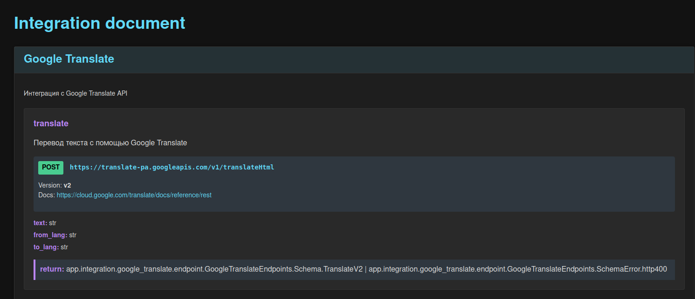

## Use Base Pattern

Функция `base_pattern` добавляет множество полезных функций в `app`, включая:

-   Заполнение `state` и другую информацию у `app`.
-   Разрешение `CORS`.
-   Подключение роутеров с поддержкой `ViewSet`.
-   Добавление метода `healthcheck`.
-   `Middleware` для отладки времени выполнения API-запросов.
-   Подробный вывод для `HTTP` исключений.
-   Добавить [docintegration](#use-docintegration)

## Use DatabaseManager

`DatabaseManager` - это универсальный инструмент для работы с РСУБД, предоставляющий как синхронные, так и асинхронные(название начинается на `a`) методы. `DatabaseManager` использует патер одиночка, поэтому может быть легко подменен в тестах.

Пример создания менеджера БД в файле `app/db/base.py`:

```python
"""Модуль подключения к РСУБД"""

from app.core.config import DATABASE_URL, DEBUG, DEV_STATUS
from fastapi_accelerator.dbsession import MainDatabaseManager

# Менеджера для РСУБД
DatabaseManager = MainDatabaseManager(DATABASE_URL, echo=DEBUG, DEV_STATUS=DEV_STATUS)
```

### Основанные компоненты `MainDatabaseManager`

-   Общие характеристики

    -   `DEV_STATUS` - Индикатор режима разработки. При `DEV_STATUS=False` блокирует выполнение критических операций (`create_all`, `drop_all`, `clear_all`). Это мера безопасности для производственной среды.

-   Синхронные компоненты

    -   `database_url` - Адрес для подключения к синхронной базе данных.
    -   `engine` - Механизм синхронного взаимодействия с БД.
    -   `session` - Генератор синхронных сессий.
    -   `Base` - Базовый класс для моделей данных.

    -   Функциональность:

        -   `get_session` - Инжектор сессии БД.
        -   `get_session_transaction` - Инжектор сессии БД с поддержкой транзакций.
        -   `create_all` - Инициализация всех таблиц в БД.
        -   `drop_all` - Удаление всей структуры БД.
        -   `clear_all` - Очистка содержимого таблиц. Параметр `exclude_tables_name` позволяет исключить определенные таблицы из процесса очистки.

-   Асинхронные компоненты

    -   `adatabase_url` - Адрес для подключения к асинхронной БД.
    -   `aengine` - Асинхронный механизм работы с БД, включая пул соединений.
    -   `asession` - Генератор асинхронных сессий.

    -   Функциональность:

        -   `aget_session` - Асинхронный инжектор сессии БД.
        -   `aget_session_transaction` - Асинхронный инжектор сессии БД с поддержкой транзакций.

### Use OrmAsync

Этот класс оптимизирует асинхронное взаимодействие с БД:

-   `get` - Извлечение объекта по заданным критериям.
-   `get_list` - Получение набора объектов по запросу. (С возможностью глубокой выборки)
-   `update` - Модификация объектов согласно запросу.
-   `delete` - Удаление объектов по заданным параметрам.
-   `get_item` - Извлечение объекта по первичному ключу. (С возможностью глубокой выборки)
-   `create_item` - Создание нового объекта. (С возможностью каскадного создания)
-   `update_item` - Обновление объекта по первичному ключу. (С возможностью каскадного обновления)
-   `delete_item` - Удаление объекта по первичному ключу. (С возможностью каскадного удаления)
-   `eager_refresh` - Полная загрузка всех связанных данных для объекта.

> Глубокая выборка/каскадные операции - это возможность работы со связанными данными.
> Активируется параметром `deep=True`
>
> Примеры:
>
> -   get_list, get_item - Возвращают объекты со всеми связанными данными, готовые для использования в Pydantic
> -   create_item - Создает записи в связанных таблицах
> -   update_item - Обновляет данные в связанных таблицах
> -   delete_item - Удаляет записи из связанных таблиц

### Создать модель через DatabaseManager

```python
from sqlalchemy import Column, Integer, String

from app.db.base import DatabaseManager


class User(DatabaseManager.Base):
    __tablename__ = "users"

    id = Column(Integer, primary_key=True, index=True)
    name = Column(String, index=True)
    login = Column(String, index=True)
    pthone = Column(String, index=True)
    email = Column(String, unique=True, index=True)
```

### Выполнение CRUD через DatabaseManager

```python
# Асинхронный вариант
class FileView:
    @router.get("/file")
    async def get_files(
        skip=Query(0),
        limit=Query(100),
        aorm: OrmAsync = Depends(DatabaseManager.aget_orm),
    ) -> List[File]:
        return await aorm.get_list(select(FileDb).offset(skip).limit(limit))

    @router.get("/file/{file_uid}")
    async def get_file(
        file_uid: str = Path(),
        aorm: OrmAsync = Depends(DatabaseManager.aget_orm),
    ) -> File:
        return await aorm.get(select(FileDb).filter(FileDb.uid == file_uid))

    @router.post("/file")
    async def create_file(
        aorm: OrmAsync = Depends(DatabaseManager.aget_orm),
    ) -> File:
        file_uid = uuid.uuid4()
        new_user = FileDb(uid=file_uid)
        return await aorm.create_item(new_user)

    @router.put("/file/{file_uid}")
    async def update_file(
        file_uid: str = Path(),
        aorm: OrmAsync = Depends(DatabaseManager.aget_orm),
    ) -> File:
        update_data = {"filename": "new"}
        return await aorm.update(
            update(FileDb).filter(FileDb.uid == file_uid), update_data
        )

    @router.delete("/file/{file_uid}")
    async def delte_file(
        file_uid: str = Path(),
        aorm: OrmAsync = Depends(DatabaseManager.aget_orm),
    ):
        return await aorm.delete(delete(FileDb).filter(FileDb.uid == file_uid))

# Синхронный вариант
@router.get("/file-sync")
async def get_file_sync(
    session: Session = Depends(DatabaseManager.get_session),
) -> List[File]:
    skip = 0
    limit = 100
    res = session.query(FileDb).offset(skip).limit(limit).all()
    return res
```

### Работа с миграциями через Alembic

1.  Установка

```bash
poetry add alembic
```

2.  Инициализация проекта

```bash
alembic init alembic
```

3.  Изменить `alembic/env.py`

```python
# Импортируем менеджера БД
from app.core.db import DatabaseManager

# > ! Импортировать модели которые нужно отлеживать
from app.models import *  # noqa F401

from fastapi_accelerator.pattern.pattern_alembic import AlembicEnv

# Преднастоенная логика для создания и выполнения миграций чрез Alembic
AlembicEnv(DatabaseManager).run()
```

4. Можем изменить `alembic.ini`

```ini
# Формат для названия файла с миграцией
file_template = %%(year)d_%%(month).2d_%%(day).2d_%%(hour).2d%%(minute).2d-%%(rev)s_%%(slug)s
```

> Важный аспект поиска миграций
>
> Нужно чтобы модели быть импортированы в `alembic/env.py` чтобы эти модели записали свои данные в `Base.metadata`
>
> Поэтому нужно:
>
> 1. В `app.models.__init__.py` импортируем все модели
>
> ```python
> from .files import *
> from .users import *
> ```
>
> 2. В `alembic/env.py` импортировать все(или только конкретные) модели
>
> ```python
> from app.models import *
> ```

5. Создавайте миграции и применяйте их

```bash
# Создавайте миграцию
alembic revision --autogenerate
# Применить миграцию к БД
alembic upgrade head
```

## Use Cache

-   Предварительная настройка, заполнить файл `app/core/cache.py`:

```python
import redis.asyncio as redis

from app.core.config import REDIS_URL

# Создаем глобальный объект Redis
redis_client = redis.from_url(REDIS_URL, encoding="utf-8", decode_responses=True)
```

-   Вы можете использовать кеширование API ответа через декоратор `@cache_redis()`

```python
from datetime import timedelta
from fastapi_accelerator.cache import cache_redis

@app.get(f"files/{{item_id}}")
@cache_redis(cache_class=redis_client, cache_ttl=timedelta(minutes=10))
async def get_item(
    request: Request,
    item_uid: str = Path(...),
    aorm: OrmAsync = Depends(DatabaseManager.aget_orm),
) -> FilesSchema:
    response = await aorm.get(
        select(Files).filter(Files.id == item_uid)
    )
    return response
```

## Use ViewSet

1. Создадим например `app/api/v1/router.py`

```python
from datetime import timedelta
from typing import List
from uuid import UUID

from fastapi import APIRouter, Depends, Query
from pydantic import BaseModel
from sqlalchemy import select
from sqlalchemy.orm import Session

from app.api.v1.schemas.file import File
from app.api.v1.schemas.timemeasurement import TaskExecution
from app.api.v1.schemas.user import User
from app.core.cache import redis_client
from app.core.db import DatabaseManager
from app.models.file import File as FileDb
from app.models.timemeasurement import TaskExecution as TaskExecutionDb
from app.models.users import User as UserDb
from fastapi_accelerator.auth_jwt import jwt_auth
from fastapi_accelerator.db.dbsession import OrmAsync
from fastapi_accelerator.paginator import DefaultPaginator
from fastapi_accelerator.viewset import AppOrm, FullViewSet

router = APIRouter(prefix="/api/v1")

class FileViewSet(FullViewSet):
    """
    Представление для работы с файлами
    """

    # Модель БД
    db_model = FileDb
    # Модель Схемы
    pydantic_model = File
    # Кеширование
    cache_class = redis_client
    cache_ttl = timedelta(minutes=10)
    # Пагинация
    paginator_class = DefaultPaginator

    async def db_update(
        self, item_id: str | int | UUID, item: type[BaseModel], aorm: OrmAsync
    ) -> object:
        """Переопределение метода db_update"""
        return await super().db_update(item_id, item, aorm)


class UserViewSet(FullViewSet):
    """
    Представление для работы с пользователями
    """

    # Модель БД
    db_model = UserDb
    # Модель Схемы
    pydantic_model = User

    def list(self):
        """Переопределение метода list"""

        @self.router.get(f"{self.prefix}", tags=self.tags)
        async def get_list_items(
            skip: int = Query(0),
            limit: int = Query(100),
            aorm: OrmAsync = Depends(AppOrm.aget_orm),
        ) -> List[self.pydantic_model]:
            return await aorm.get_list(
                select(self.db_model).offset(skip).limit(limit),
                deep=self.deep_schema,
                db_model=self.db_model,
            )
        return get_list_items

class TaskExecutionViewSet(FullViewSet):
    """
    Представление для работы трудозатратами
    """

    # Модель БД
    db_model = TaskExecutionDb
    # Модель Схемы
    pydantic_model = TaskExecution

    # Пагинация
    paginator_class = DefaultPaginator

    # Включить поддержку вложенных схем pydantic
    # это значит что будет происходить рекурсивное
    # создание, обновление, удаление связанных записей
    deep_schema = True

    # Включить защиту через JWT
    dependencies = [Depends(jwt_auth)]

# Подключить ViewSet
router.views = [
    FileViewSet().as_view(router, prefix="/file"),
    UserViewSet().as_view(router, prefix="/user"),
    TaskExecutionViewSet().as_view(router, prefix="/taskexecution"),
]
```

## Use Time Zone

Получить текущие время сервера с учётом его временной зоны

```python
import pytz
from fastapi_accelerator.timezone import get_datetime_now

# Вариант 1
get_datetime_now(request.app.state.TIMEZONE).isoformat()
# Вариант 2
get_datetime_now(app.state.TIMEZONE).isoformat()
# Вариант 3
get_datetime_now(pytz.timezone("Europe/Moscow")).isoformat()
# Вариант 4
timezone = TIMEZONE() or TIMEZONE(request.app)
get_datetime_now(timezone).isoformat()
```

## Use HTTPException

-   Использование:

```python
from fastapi_accelerator.exception import HTTPException403

@router.get("/")
async def get_users():
    if True:
        raise HTTPException403()
    return [{"user_id": "user1"}, {"user_id": "user2"}]
```

## Use AuthJWT

Использование аутентификация через JWT

-   Подключить к FastAPI проекту:

```python
from fastapi_accelerator.auth_jwt import BaseAuthJWT

class AuthJWT(BaseAuthJWT):
    async def check_auth(username: str, password: str) -> bool:
        """Проверка введенного логина и пароля."""
        return username == "admin" and password == "admin"

    async def add_jwt_body(username: str) -> dict:
        """Функция для добавление дополнительных данных в JWT токен пользователя"""
        return {"version": username.title()}


# Подключить аутентификацию по JWT
AuthJWT.mount_auth(app)
```

-   Пример защиты API метода:

```python
from fastapi_accelerator.auth_jwt import jwt_auth

@app.get("/check_protected", summary="Проверить аутентификацию по JWT")
async def protected_route(jwt: dict = Depends(jwt_auth)):
    return {"message": "This is a protected route", "user": jwt}
```

## Use Integration

Большинство API-сервисов взаимодействуют с другими API или gRPC/RPC сервисами. Такие интеграции могут быть сложными и часто оказываются не полностью понятно разработчикам. Из-за этого они легко превращаются в легаси-код, который сложно поддерживать, а тестирование интеграций локально зачастую невозможно.

Важно, чтобы в проекте была библиотека, следящая за качеством написания интеграций и заставляющая документировать их для упрощения дальнейшей поддержки. Именно для этого я разработал специальные модули:

-   `IntegrationHTTP`: Класс для создания интеграций по HTTP.
-   `Stability Patterns`: Паттернов стабильности для применения к методам интеграции.
-   `py2dantic`: Утилита для перевода Python dict в Pydantic схему.
-   `docintegration`: Авто генерация документации, для используемых интеграций.

### Use Integration HTTP

`IntegrationHTTP` - Класс для создания методов интеграции по HTTP, централизует логику вызовов к внешним системам, проводя валидацию исходящих данных. Также в классе указывается версия и документация внешнего API.

Преимущества использования этого подхода:

-   Явная спецификация форматов запроса и ответа.
-   Легкая переносимость кода между проектами — достаточно импортировать классы, основанные на `IntegrationHTTP`.
-   Консолидация логики внешних запросов в одном месте, что упрощает поддержку.
-   Возможность легко заменять реальные методы на `mock` для тестирования.
-   Легкое внедрение `Stability Patterns` для методов интеграции.

Для создания интеграции следуйте следующим шагам:

1.  Рекомендуется располагать код интеграций в директории `app/integration/ИмяПакетаИнтеграции`.
2.  Создать класса интеграций `app/integration/ИмяПакетаИнтеграции/endpoint.py`:

    ```python
    import httpx
    from pydantic import BaseModel

    from fastapi_accelerator.integration.http_integration import (
        ApiHTTP,
        EndpointsDeclaration,
        HTTPMethod,
        IntegrationHTTP,
    )
    from fastapi_accelerator.integration.stability_patterns import sp

    class ИмяIntegration(EndpointsDeclaration):

        integration = IntegrationHTTP(
            "Имя Интеграции",
            doc="Интеграция с ... API",
        )

        class Schema:
            """Схемы Pydantic для успешных ответов"""

            class Successful(BaseModel)
                body: str

        class SchemaError:
            """Схемы Pydantic для не успешных ответов"""

            class http400(BaseModel)
                error: str

        @integration.endpoint(
            HTTPMethod.post,
            "/путь",
            version="...",
            docurl="https://..."
        )
        @sp.RetryPattern()
        async def имя_метода(api: ApiHTTP, аргумент_1: str) -> Schema.Successful | SchemaError.http400:
            try:
                response: httpx.Response = await api.client.post(api.url.geturl(), json=...)
                return response.json()
            except httpx.RequestError as e:
                raise e
    ```

3.  Настроить и подключить интеграции к проекту `app/core/useintegration.py`:

    ```python
    """Интеграции используемые в проекте"""

    from app.integration.ИмяПакетаИнтеграции.endpoint import ИмяIntegration

    # Создание экземпляра интеграции
    имя_api = ИмяIntegration(
        # Начало для url пути
        base_url="https://путь...",
        # Доступы, которые можем использовать в методах интеграции
        credentials={...},
    )
    ```

4.  Пример использования класса интеграции в `FastAPI`:

    ```python
    from app.core.useintegration import имя_api
    from app.integration.ИмяПакетаИнтеграции.schema import ИмяSchema

    @router.get("/имя")
    async def имя(аргумент_1: str) -> ИмяIntegration.Schema.Successful:
        # Вызвать метод интеграции
        return await имя_api.имя_метода(аргумент_1)
    ```

---

Вам необходимо указывать тип возвращаемого объекта из метода интеграции.

Ответ может быть:

-   `dict`: который можно конвертировать в одну схему `Pydantic`.
-   `list[dict]`: который можно конвертировать в список схем `Pydantic`.
-   Несколько типов ответа: Это необходимо для указания типа корректного ответа и для обработки ошибок. Например, `-> УспешныйОтвет | НеУспешныйОтвет` или `-> list[УспешныйОтвет] | НеУспешныйОтвет`.
-   В худшем случае можете указать `Any`.

#### Пример интеграции с Google Translate

-   Класса интеграции `app/integration/google_translate/endpoint.py`:

```python
import httpx
from pydantic import BaseModel

from fastapi_accelerator.integration.http_integration import (
    ApiHTTP,
    EndpointsDeclaration,
    HTTPMethod,
    IntegrationHTTP,
)
from fastapi_accelerator.integration.stability_patterns import sp


class GoogleTranslateEndpoints(EndpointsDeclaration):
    integration = IntegrationHTTP(
        "Google Translate",
        doc="Интеграция с Google Translate API",
    )

    class Schema:
        """Схемы для успешных ответов"""

        class TranslateV2(BaseModel):
            text: str

    class SchemaError:
        """Схемы для не успешных ответов"""

        class http400Error(BaseModel):
            code: int
            message: str
            errors: list[dict]
            status: str
            details: list[dict]

        class http400(BaseModel):
            error: dict

    @integration.endpoint(
        HTTPMethod.post,
        "/v1/translateHtml",
        version="v2",
        docurl="https://cloud.google.com/translate/docs/reference/rest",
    )
    # Применяем паттерны стабильности
    @sp.Timeout()
    # Автоматически повторяет запрос при возникновении ошибки.
    @sp.RetryPattern()
    async def translate(
        api: ApiHTTP,
        text: str,
        from_lang: str,
        to_lang: str,
    ) -> Schema.TranslateV2 | SchemaError.http400:  # Указать типа ответа
        """Перевод текста с помощью Google Translate"""
        try:
            # Выполнить запрос к внешней системе
            response: httpx.Response = await api.client.post(
                api.url.geturl(),
                json=[[text.split("\n"), from_lang, to_lang], "te_lib"],
                headers={
                    "content-type": "application/json+protobuf",
                    "x-goog-api-key": api.credentials["API_TOKEN"],
                },
            )
            # Обработка ответа
            print(f"Processed {api.url}: Status {response.status_code}")
            return {"text": "\n".join(x[0] for x in response.json())}
        except httpx.RequestError as e:
            print(f"Error processing {api.url}: {e}")
            raise e
```

-   Подключение в `app/core/useintegration.py`:

```python
"""Интеграции используемые в проекте"""

from app.integration.google_translate.endpoint import GoogleTranslateIntegration

# Создание экземпляра интеграции
gtapi = GoogleTranslateIntegration(
    base_url="https://translate-pa.googleapis.com",
    # Сохраняем в класс доступы, которые можем использовать в методах интеграции
    credentials={"API_TOKEN": "..."},
)
```

-   Пример использования в эндпоинте `FastAPI`:

```python
from datetime import timedelta
from fastapi_accelerator.cache import cache_redis
from app.core.cache import redis_client
from app.core.useintegration import gtapi
from app.integration.google_translate.schema import GoogleTranslateSchema

@router.get("/translate")
# Можем легко кешировать ответы от интеграций
@cache_redis(cache_class=redis_client, cache_ttl=timedelta(minutes=10))
async def translate(
    text: str, from_lang: str = "en", to_lang: str = "ru"
) -> GoogleTranslateEndpoints.Schema.TranslateV2:
    # Вызвать метод интеграции
    return await gtapi.translate(text, from_lang, to_lang)
```

### Use Stability Patterns

Модуль поддерживает паттерны стабильности (Stability Patterns), которые помогают избежать ошибок и перегрузок при работе с внешними сервисами.

> Основным критерием не успешного выполнения является возникновение исключения (raise) в методе интеграции. Если вы получили ответ с кодом 400 (ошибка клиента) или 500 (ошибка сервера), но не вызвали исключение, Stability Patterns будет считать это успешным выполнением и не применит свою логику для обработки ошибок.

Ниже приведено описание основных декораторов:

-   `@sp.Fallback` (Резервный вариант) - Предоставляет альтернативный путь выполнения в случае сбоя основного. Позволяет системе деградировать контролируемо, а не падать с ошибкой.
-   `@sp.Timeout` (Тайм-аут) - Ограничивает время ожидания ответа от внешнего сервиса. Предотвращает блокировку ресурсов при зависании вызова.
-   `@sp.CircuitBreaker` (Предохранитель) - Отслеживает количество ошибок при вызове внешнего сервиса. При превышении лимита временно блокирует вызов, предотвращая каскадные сбои.
-   `@sp.RetryPattern` (Паттерн повторения) - Автоматически повторяет запрос при возникновении ошибки.
-   `@sp.Throttling` (Регулирование) - Ограничивает количество запросов к ресурсу для предотвращения его перегрузки. Защищает систему от шторма запросов.

Эти паттерны делают систему более устойчивой, минимизируя риск сбоев и обеспечивая плавную деградацию при возникновении проблем.

### Use py2dantic

`py2dantic` — это удобная утилита, которая позволяет быстро создавать схемы Pydantic из словарей Python. Эти схемы можно эффективно использовать для типизации в вашем проекте.

-   Пример использования:

```python
from fastapi_accelerator.commands.py2dantic import generate_pydantic_models

sample_data = {
    "items": [
        {
            "id": "0000",
            "premium": False,
            "name": "Python Developer",
            "department": None,
            "has_test": True,
            "response_letter_required": False,
            "salary": None,
            "type": {"id": "open", "name": "Открытая"},
            "address": None,
            "response_url": None,
            "sort_point_distance": None,
            "published_at": "2024-09-04T08:27:02+0300",
            "created_at": "2024-09-04T08:27:02+0300",
            "archived": False,
            "apply_alternate_url": "https://hh.ru/applicant/vacancy_response?vacancyId=0000",
            "branding": {"type": "MAKEUP", "tariff": None},
            "show_logo_in_search": True
        },
    ],
    "found": 187,
    "pages": 2,
    "page": 1,
    "per_page": 100,
    "clusters": None,
    "arguments": None,
    "fixes": None,
    "suggests": None,
    "alternate_url": "https://hh.ru/search/vacancy?enable_snippets=true&items_on_page=100&order_by=publication_time&page=1&salary=200000&schedule=remote&text=Python+FastAPI",
}

assert (
    generate_pydantic_models(sample_data, depth=2, prfix_class_name="Job").strip()
    == """
class Job_ItemsItem(BaseModel):
    id: str = None
    premium: int = None
    name: str = None
    department: Any = None
    has_test: int = None
    response_letter_required: int = None
    area: Dict = None
    salary: Any = None
    type: Dict = None
    address: Any = None
    response_url: Any = None
    sort_point_distance: Any = None
    published_at: str = None
    created_at: str = None
    archived: int = None
    apply_alternate_url: str = None
    branding: Dict = None
    show_logo_in_search: int = None

class Job(BaseModel):
    items: List[Job_ItemsItem]
    found: int = None
    pages: int = None
    page: int = None
    per_page: int = None
    clusters: Any = None
    arguments: Any = None
    fixes: Any = None
    suggests: Any = None
    alternate_url: str = None
    """.strip()
    )
```

### Use docintegration

Данный функционал позволяет узнать, какие интеграции используются в проекте, аналогично тому, как это реализовано в OpenAPI Swagger для стандартного FastAPI.

Документация доступна по адресу: `http://host:port/docintegration`.

Чтобы активировать этот путь, необходимо в файле `main.py` в параметре `base_pattern` указать список интеграций в аргументе `useintegration`:

```python
from app.core.useintegration import интеграция_1, интеграция_2
from fastapi_accelerator.pattern.pattern_fastapi import base_pattern

# Паттерн для проекта
base_pattern(
    app,
    ...,
    useintegration=[интеграция_1, интеграция_2],
)
```



## Use Admin Panel

1.  Установка

```bash
poetry add flask-admin
```

2. Создать файл `admin_panel.py`

```python
from flask import Flask

from app.core.config import ADMIN_PASSWORD, ADMIN_USERNAME, SECRET_KEY
from app.db.base import DatabaseManager
from app.models import File, User
from fastapi_accelerator.pattern_flask_admin import base_pattern

app = Flask(__name__)

admin = base_pattern(
    app,
    SECRET_KEY,
    ADMIN_PASSWORD,
    ADMIN_USERNAME,
    # > Модели которые нужны в админ панели
    models=[User, File],
    database_manager=DatabaseManager,
)


if __name__ == "__main__":
    app.run(
        host="0.0.0.0",
        port=8001,
        debug=True,
    )
```

3. Запускать `python admin_panel.py`

4. Войти в админ панель:

-   `http://localhost:8233/admin`
-   `http://localhost:8233/login`
-   `http://localhost:8233/logout`
